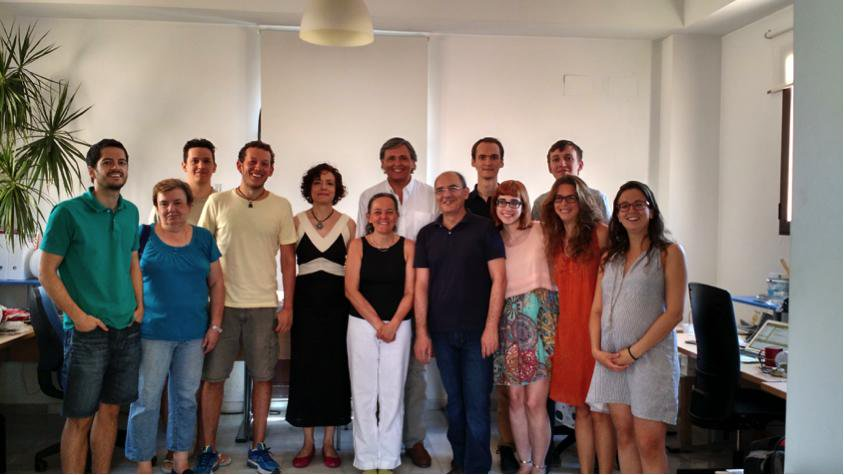
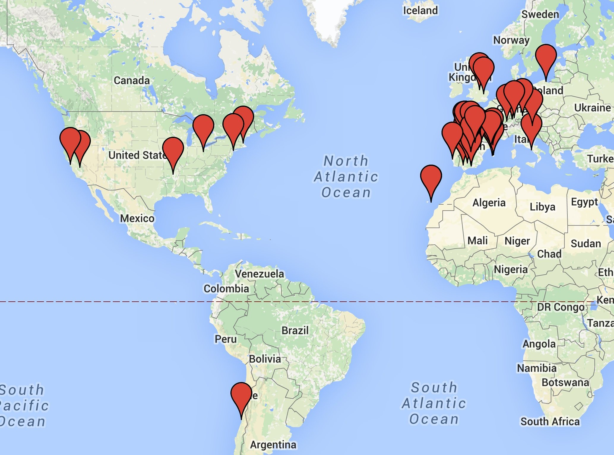
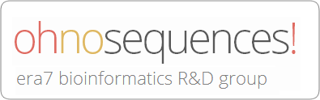
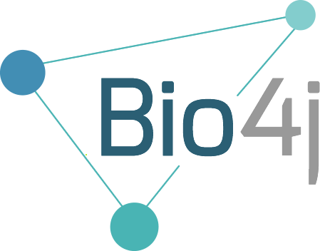
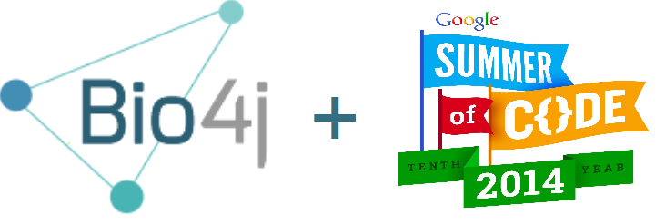

---
title:  "Era7 bionformatics"
subtitle: "Presentación y Software Libre"
author: "Eduardo Pareja-Tobes, CTO"
date: "2016-05-06"
...

# Era7?

## Era7 bioinformatics

### La empresa

Fundada en **2006** en Granada, hacemos **análisis de datos**. Genómica, principalmente de  [secuenciación de ADN](https://en.wikipedia.org/wiki/DNA_sequencing).

### Claves

- **Open source 100%** *Todo* lo que hacemos!
- **Cloud computing** *AWS*, cientos de servidores a diario
- **Investigación** Bioinformática, Biología, Informática

## Equipo

{ width=80% }

## Dónde?

{ width=60% }

## Dónde?

{ width=60% }

## Dónde?

{ width=60% }

## Clientes

{ width=70% }

## Investigación

\ {width=60% align=left}

\  

Parte **fundamental** de nuestra actividad: en **2015** hemos publicado **16** papers y preprints.

En *qué?* **Bioinformática**, **Biología**, **Informática**: bacterial genomics, cloud data analysis, graph databases, ...

# Software libre!

## Nuestro modelo

**Todo** lo que hacemos es **abierto**.

*Licencia*? **[AGPLv3](https://tldrlegal.com/license/gnu-affero-general-public-license-v3-%28agpl-3.0%29)**. 100% abierto, 100% *[copyleft](https://es.wikipedia.org/wiki/Copyleft)*.

Cobramos por hacer algo *ahora* (servicios), no por lo que *hicimos* (licencias).

## Bio4j

\ { width=40% }

Plataforma para datos bioinformáticos/biológicos.

- Modelo basado en **typed graphs**
- APIs genéricas en **Java** y **Scala** (unreleased)
- **AWS** deployment

## GSoC14

## GitHub

Desde *2011*, para **todo**:

> - **Análisis de datos** primeros en coordinar **crowdsourced data analysis** en github: [2011 *E. coli* outbreak](https://github.com/ehec-outbreak-crowdsourced/BGI-data-analysis)
> - **documentación** interna, [websites](https://github.com/bio4j/bio4j.github.com), [papers](https://github.com/ohnosequences/mg7/tree/master/docs/mg7-preprint), [slides](https://github.com)
> - Y, por supuesto, **código!** [era7bio](https://github.com/era7bio), [ohnosequences](https://github.com/ohnosequences), [bio4j](https://github.com/bio4j)

## Tecnologías, lenguajes, conocimiento

No podríamos vivir sin **Amazon Web Services**, en particular *S3*, *EC2*, *SQS*, *DynamoDB*.

**Graph databases** para Bio4j, para análisis de datos, ...

*Lenguajes?* **Scala** en un 90%, **Java** el resto.

Hay matemáticos sueltos, así que mucha **programación funcional** y **teoría de categorías**.

## Qué estamos haciendo ahora

**Muchos** proyectos interesantes! Dos ejemplos:

. . .

> - type-safe generic Scala **graph data APIs**, en desarrollo desde hace dos años
> - Diseño de un **graph database engine** ([**Idris**](http://www.idris-lang.org/) + Scala)

## Conclusiones

. . .

> - Es **posible** hacer todo **libre!**
> - Hay que currar **mucho**
> - Vale la pena

<!--

----

# Qué hacemos

## Análisis de datos

Muchos datos de [secuenciación de ADN](https://en.wikipedia.org/wiki/DNA_sequencing).

## Investigación

## Bio4j

Plataforma para datos biológicos basada en bases de datos de grafos.

# Cómo?

## Abierto

- **Todo** lo que hacemos es **abierto**
- *Licencia*? **[AGPLv3](https://tldrlegal.com/license/gnu-affero-general-public-license-v3-%28agpl-3.0%29)**.
- *NO* licencia dual

----

### Github

----

### AWS

Nuestras propias librerías

### Tecnologías

En producción

- EC2: Titan, DynamoDB

En producción

- Scala, Java

-->
